# Langgraph4j Deep Researcher

A deep research assistant based on the Langgraph4j framework with iterative deep research capabilities.

> 📖 **Language**: [English](README.md) | [中文](README_CN.md)

## Project Overview

Langgraph4j Deep Researcher is an intelligent research assistant that can:

- 🔍 **Intelligent Search Query Generation**: Automatically generate optimized search queries based on research topics
- 🌐 **Multi-round Iterative Search**: Execute multiple rounds of web searches to progressively deepen research on topics
- 📝 **Intelligent Content Summarization**: Integrate search results into coherent research summaries
- 🤔 **Knowledge Gap Reflection**: Analyze existing summaries, identify knowledge gaps and generate new queries
- 📋 **Final Report Organization**: Generate structured Markdown research reports

## Technology Stack

- **Java 17** - Modern Java development
- **Spring Boot 3.1.0** - Enterprise web framework
- **Langgraph4j** - Graph execution engine and workflow orchestration
- **Langchain4j** - AI model integration and tool calling
- **Tavily Search API** - High-quality web search

## Project Architecture

```
langgraph4j-deep-researcher/
├── langgraph4j-deep-researcher-api/          # API interface definitions and data transfer objects
├── langgraph4j-deep-researcher-config/       # Configuration management and prompt templates
├── langgraph4j-deep-researcher-tools/        # Search tool integration (supports multiple search engines)
├── langgraph4j-deep-researcher-core/         # Core business logic and services
└── langgraph4j-deep-researcher-starter/      # Startup module and configuration files
```

## Quick Start

### 1. Environment Requirements

- Java 17+
- Maven 3.6+
- Tavily API Key (optional, for web search)

### 2. Configuration Setup

Edit `langgraph4j-deep-researcher-starter/src/main/resources/application.yml`:

```yaml
deep-research:
  model:
    api-key: ${CHAT_MODEL_API_KEY:your-api-key}
    api-url: ${CHAT_MODEL_API_URL:https://api.openai.com/v1}
    model-name: ${CHAT_MODEL_MODEL_NAME:gpt-4o-mini}
  
  search:
    tavily:
      api-key: ${TAVILY_API_KEY:your-tavily-api-key}
```

Or set environment variables:

```bash
export CHAT_MODEL_API_KEY=your-api-key
export CHAT_MODEL_API_URL=https://api.openai.com/v1
export TAVILY_API_KEY=your-tavily-api-key
```

### 3. Build and Run

```bash
# Build project
mvn clean package -DskipTests

# Run application
mvn spring-boot:run -pl langgraph4j-deep-researcher-starter

# Or run jar directly
java -jar langgraph4j-deep-researcher-starter/target/langgraph4j-deep-researcher-starter-1.0.0-SNAPSHOT.jar
```

The application will start at http://localhost:8080.

### 4. API Usage

#### Execute Deep Research

```bash
curl -X POST http://localhost:8080/api/v1/research/execute \
  -H "Content-Type: application/json" \
  -d '{
    "research_topic": "Latest applications of artificial intelligence in healthcare",
    "max_research_loops": 3,
    "search_engine": "tavily",
    "max_search_results": 3,
    "fetch_full_page": true,
    "user_id": "tom"
  }'
```

#### Get Available Search Engines

```bash
curl http://localhost:8080/api/v1/research/search-engines
```

#### Health Check

```bash
curl http://localhost:8080/api/v1/research/health
```

## AG-UI integration using CopilotKit

### Build and Run Langgraph4j server

# Build project

```
mvn clean package -DskipTests
```
# Run application

```
mvn spring-boot:run -pl langgraph4j-deep-researcher-starter
```

### Build and Run Copilotkit server

```
cd webui

npm install

npm run dev
```

open http://localhost:3000/


## Workflow

Langgraph4j Deep Researcher uses the following workflow:

```mermaid
graph TD
    A[User Input Research Topic] --> B[QueryGeneratorNode<br/>🎯 Generate Search Query]
    B --> C[WebSearchNode<br/>🔍 Execute Web Search]
    C --> D[SummarizerNode<br/>📝 Summarize Search Results]
    D --> E[ReflectionNode<br/>🤔 Reflect on Knowledge Gaps]
    E --> F{RouteResearch<br/>🚦 Routing Decision}
    F -->|continue<br/>Max loops not reached| G[Generate New Query]
    G --> C
    F -->|finalize<br/>Max loops reached| H[FinalizerNode<br/>✅ Final Organization]
    H --> I[Output Final Research Report]
```



## Configuration Guide

### Model Configuration

```yaml
deep-research:
  model:
    api-key: your-api-key               # API KEY
    api-url: https://api.openai.com/v1  # API URL
    model-name: gpt-4o-mini             # Model name
    temperature: 0.1                    # Temperature parameter
    max-tokens: 4096                    # Maximum token count
```

### Search Engine Configuration

```yaml
deep-research:
  search:
    default-engine: tavily              # Default search engine
    tavily:
      api-key: your-tavily-api-key      # Tavily API Key
      search-depth: advanced            # Search depth
      include-raw-content: true         # Whether to include raw content
```

### Research Flow Configuration

```yaml
deep-research:
  flow:
    default-max-loops: 3                # Default maximum loop count
    default-max-search-results: 3       # Default search result count
    default-fetch-full-page: true       # Whether to fetch full page
    max-tokens-per-source: 1000         # Maximum tokens per source
```

## Extending Search Engines

Langgraph4j Deep Researcher supports an extensible search engine architecture. To add a new search engine:

1. Implement the `SearchEngine` interface
2. Register as a Spring component
3. Configure corresponding parameters

Example:

```java
@Component("customSearchEngine")
public class CustomSearchEngine implements SearchEngine {
    
    @Override
    public List<SearchResult> search(String query, int maxResults, boolean fetchFullPage) {
        // Implement search logic
    }
    
    @Override
    public String getEngineName() {
        return "custom";
    }
    
    @Override
    public boolean isAvailable() {
        // Check availability
    }
}
```

## Monitoring and Logging

### Health Check

- **Endpoint**: `/api/v1/research/health`
- **Actuator**: `/actuator/health`

### Logging Configuration

```yaml
logging:
  level:
    io.github.imfangs.ai.deepresearch: DEBUG
    dev.langchain4j: INFO
    org.bsc.langgraph4j: INFO
```

### Metrics Monitoring

The application integrates Spring Boot Actuator, providing the following monitoring endpoints:

- `/actuator/health` - Health status
- `/actuator/metrics` - Application metrics
- `/actuator/prometheus` - Prometheus format metrics

## Development Guide

### Local Development

```bash
# Clone project
git clone <repository-url>
cd langgraph4j-deep-researcher

# Install dependencies
mvn clean install

# Run tests
mvn test

# Start development server
mvn spring-boot:run -pl langgraph4j-deep-researcher-starter
```

### Code Structure

- **API Layer**: Define interface specifications and data transfer objects
- **Config Layer**: Manage configurations and prompt templates
- **Tools Layer**: Integrate external search tools
- **Core Layer**: Core business logic and services
- **Graph Layer**: LangGraph4j workflow definitions
- **Starter Layer**: Application startup and configuration

## Troubleshooting

### Log Debugging

Enable detailed logging:

```yaml
logging:
  level:
    io.github.imfangs.ai.deepresearch: DEBUG
    org.bsc.langgraph4j: DEBUG
```

## Contributing

1. Fork the project
2. Create a feature branch (`git checkout -b feature/amazing-feature`)
3. Commit your changes (`git commit -m 'Add some amazing feature'`)
4. Push to the branch (`git push origin feature/amazing-feature`)
5. Open a Pull Request

## License

This project is licensed under the [MIT License](LICENSE).
