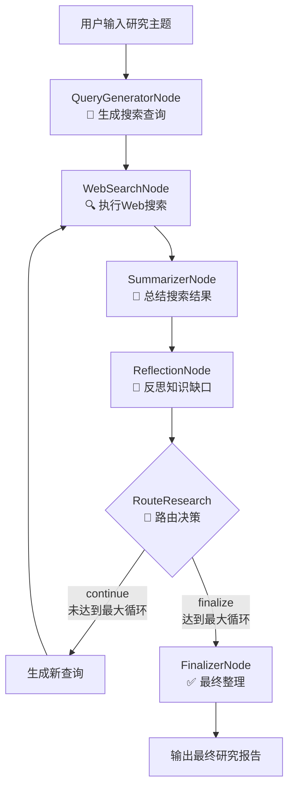

# Langgraph4j Deep Researcher

基于 Langgraph4j 框架的深度研究助手，具备迭代式深度研究能力。

> 📖 **语言**: [English](README.md) | [中文](README_CN.md)

## 项目概述

Langgraph4j Deep Researcher 是一个智能研究助手，能够：

- 🔍 **智能搜索查询生成**：根据研究主题自动生成优化的搜索查询
- 🌐 **多轮迭代搜索**：执行多轮Web搜索，逐步深入研究主题
- 📝 **智能内容总结**：将搜索结果整合成连贯的研究总结
- 🤔 **知识缺口反思**：分析现有总结，识别知识缺口并生成新查询
- 📋 **最终报告整理**：生成结构化的Markdown研究报告

## 技术栈

- **Java 17** - 现代Java开发
- **Spring Boot 3.1.0** - 企业级Web框架
- **Langgraph4j** - 图执行引擎和工作流编排
- **Langchain4j** - AI模型集成和工具调用
- **Tavily Search API** - 高质量Web搜索

## 项目架构

```
langgraph4j-deep-researcher/
├── langgraph4j-deep-researcher-api/          # API 接口定义和数据传输对象
├── langgraph4j-deep-researcher-config/       # 配置管理和提示词模板
├── langgraph4j-deep-researcher-tools/        # 搜索工具集成（支持多搜索引擎）
├── langgraph4j-deep-researcher-core/         # 核心业务逻辑和服务
└── langgraph4j-deep-researcher-starter/      # 启动模块和配置文件
```

## 快速开始

### 1. 环境要求

- Java 17+
- Maven 3.6+
- Tavily API Key（可选，用于Web搜索）

### 2. 配置设置

编辑 `langgraph4j-deep-researcher-starter/src/main/resources/application.yml`：

```yaml
deep-research:
  model:
    api-key: ${CHAT_MODEL_API_KEY:your-api-key}
    api-url: ${CHAT_MODEL_API_URL:https://api.openai.com/v1}
    model-name: ${CHAT_MODEL_MODEL_NAME:gpt-4o-mini}
  
  search:
    tavily:
      api-key: ${TAVILY_API_KEY:your-tavily-api-key}
```

或设置环境变量：

```bash
export CHAT_MODEL_API_KEY=your-api-key
export CHAT_MODEL_API_URL=https://api.openai.com/v1
export TAVILY_API_KEY=your-tavily-api-key
```

### 3. 构建和运行

```bash
# 构建项目
mvn clean package -DskipTests

# 运行应用
mvn spring-boot:run -pl langgraph4j-deep-researcher-starter

# 或直接运行jar包
java -jar langgraph4j-deep-researcher-starter/target/langgraph4j-deep-researcher-starter-1.0.0-SNAPSHOT.jar
```

应用将在 http://localhost:8080 启动。

### 4. API 使用

#### 执行深度研究

```bash
curl -X POST http://localhost:8080/api/v1/research/execute \
  -H "Content-Type: application/json" \
  -d '{
    "research_topic": "人工智能在医疗领域的最新应用",
    "max_research_loops": 3,
    "search_engine": "tavily",
    "max_search_results": 3,
    "fetch_full_page": true,
    "user_id": "tom"
  }'
```

#### 获取可用搜索引擎

```bash
curl http://localhost:8080/api/v1/research/search-engines
```

#### 健康检查

```bash
curl http://localhost:8080/api/v1/research/health
```

## 工作流程

Langgraph4j Deep Researcher 使用以下工作流程：



## 配置说明

### 模型配置

```yaml
deep-research:
  model:
    api-key: your-api-key               # API KEY
    api-url: https://api.openai.com/v1  # API 地址
    model-name: gpt-4o-mini             # 模型名称
    temperature: 0.1                    # 温度参数
    max-tokens: 4096                    # 最大token数
```

### 搜索引擎配置

```yaml
deep-research:
  search:
    default-engine: tavily              # 默认搜索引擎
    tavily:
      api-key: your-tavily-api-key      # Tavily API Key
      search-depth: advanced            # 搜索深度
      include-raw-content: true         # 是否包含原始内容
```

### 研究流程配置

```yaml
deep-research:
  flow:
    default-max-loops: 3                # 默认最大循环次数
    default-max-search-results: 3       # 默认搜索结果数
    default-fetch-full-page: true       # 是否获取完整页面
    max-tokens-per-source: 1000         # 每个源的最大token数
```

## 扩展搜索引擎

Langgraph4j Deep Researcher 支持可扩展的搜索引擎架构。要添加新的搜索引擎：

1. 实现 `SearchEngine` 接口
2. 注册为 Spring 组件
3. 配置相应的参数

示例：

```java
@Component("customSearchEngine")
public class CustomSearchEngine implements SearchEngine {
    
    @Override
    public List<SearchResult> search(String query, int maxResults, boolean fetchFullPage) {
        // 实现搜索逻辑
    }
    
    @Override
    public String getEngineName() {
        return "custom";
    }
    
    @Override
    public boolean isAvailable() {
        // 检查可用性
    }
}
```

## 监控和日志

### 健康检查

- **端点**：`/api/v1/research/health`
- **Actuator**：`/actuator/health`

### 日志配置

```yaml
logging:
  level:
    io.github.imfangs.ai.deepresearch: DEBUG
    dev.langchain4j: INFO
    org.bsc.langgraph4j: INFO
```

### 指标监控

应用集成了 Spring Boot Actuator，提供以下监控端点：

- `/actuator/health` - 健康状态
- `/actuator/metrics` - 应用指标
- `/actuator/prometheus` - Prometheus 格式指标

## 开发指南

### 本地开发

```bash
# 克隆项目
git clone <repository-url>
cd langgraph4j-deep-researcher

# 安装依赖
mvn clean install

# 运行测试
mvn test

# 启动开发服务器
mvn spring-boot:run -pl langgraph4j-deep-researcher-starter
```

### 代码结构

- **API层**：定义接口规范和数据传输对象
- **Config层**：管理配置和提示词模板
- **Tools层**：集成外部搜索工具
- **Core层**：核心业务逻辑和服务
- **Graph层**：LangGraph4j 工作流定义
- **Starter层**：应用启动和配置

## 故障排除

### 日志调试

启用详细日志：

```yaml
logging:
  level:
    io.github.imfangs.ai.deepresearch: DEBUG
    org.bsc.langgraph4j: DEBUG
```

## 贡献指南

1. Fork 项目
2. 创建特性分支 (`git checkout -b feature/amazing-feature`)
3. 提交更改 (`git commit -m 'Add some amazing feature'`)
4. 推送分支 (`git push origin feature/amazing-feature`)
5. 开启 Pull Request

## 许可证

本项目采用 [MIT License](LICENSE) 许可证。
